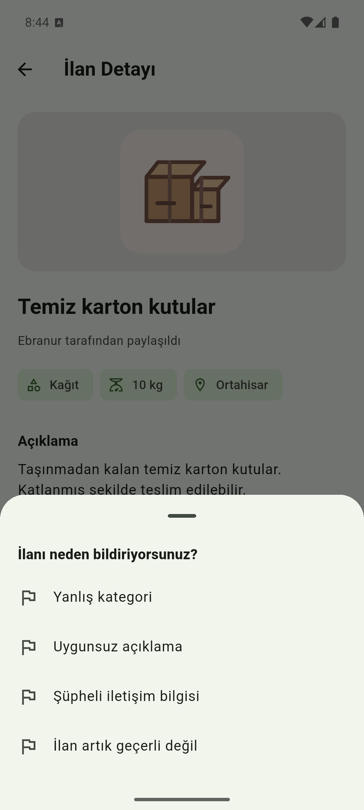
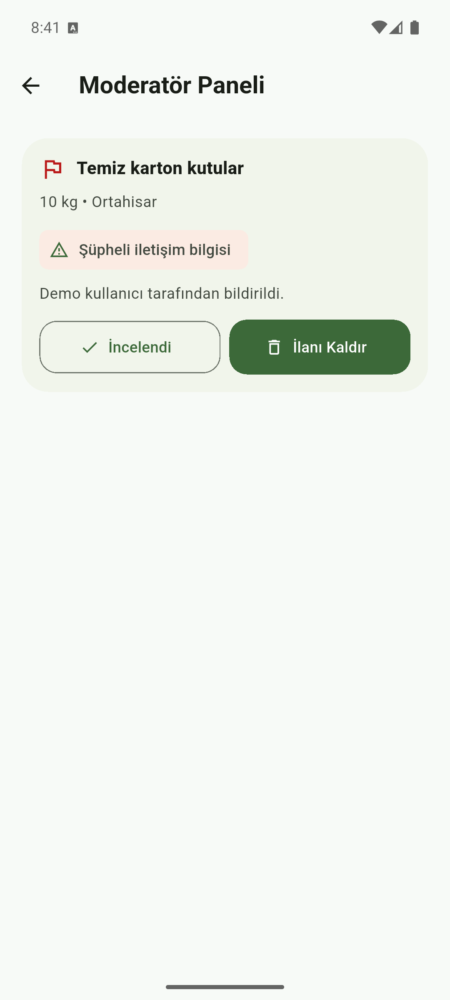

# Sıfır Atık

Sıfır Atık, kullanılabilir durumdaki atıkların ilan olarak paylaşılabildiği bir
Flutter mobil uygulamasıdır. Projede temel amaç; karton, cam, plastik veya
elektronik gibi değerlendirilebilir atıkların ihtiyaç duyan kişiler tarafından
daha kolay bulunmasını sağlamaktır.

Projeyi Flutter ile Android ve iOS için geliştirdim. Temel kullanıcı akışlarını
Android emülatörde, iOS derleme ve arayüz kontrolünü ise iPhone simülatöründe
denedim. iOS sürümü için minimum desteklenen işletim sistemi iOS 15'tir.

## Projenin Amacı

Uygulamada kullanıcılar ellerindeki atıkları ilan olarak paylaşabiliyor. Başka
bir kullanıcı ilana talep gönderebiliyor. İlan sahibi talebi kabul ederse iletişim
bilgisi açılıyor ve kullanıcılar arama ya da WhatsApp üzerinden iletişim
kurabiliyor.

Bu şekilde uygulama sadece ilanların listelendiği bir ekran olmaktan çıkıp, ilan
oluşturma ve talep takibi olan daha tamamlanmış bir akışa dönüşüyor.

## Uygulamada Neler Var?

### Giriş ve kullanıcı akışı

- E-posta ve şifre ile kayıt olma / giriş yapma
- Bireysel veya şirket / kurum hesabı oluşturma
- Kurumsal kayıtta kurum türü, yetkili kişi ve şehir bilgilerini kaydetme
- Profilde hesap türünü ve kurumsal doğrulama durumunu görme
- Google ile giriş desteği
- Şifre sıfırlama ekranı
- Uygulama açıldığında oturum kontrolü
- Çıkış yapma

### İlan akışı

- Atık ilanı oluşturma
- İlanlara fotoğraf ekleme
- Fotoğrafı güncelleme veya kaldırma
- Şehir ve ilçeyi arayarak seçme
- İlanları listeleme ve detayını görme
- Kategoriye göre filtreleme
- İlanları bireysel veya kurumsal hesap türüne göre filtreleme
- Kurumsal ve doğrulanmış kurum ilanlarını rozetle ayırt etme
- Başlık, kategori ve konuma göre arama yapma
- Kullanıcının kendi ilanlarını düzenlemesi ve silmesi

### Talep ve iletişim akışı

- Başka kullanıcının ilanına talep gönderme
- Kullanıcının kendi ilanına talep göndermesini engelleme
- Gönderilen talepleri takip etme
- İlan sahibinin talebi kabul veya reddetmesi
- Talep durumunu beklemede, kabul edildi veya reddedildi olarak gösterme
- Kabul edilen talepte telefon bilgisini açma
- Arama ve WhatsApp üzerinden iletişim kurma
- Yeni talep geldiğinde ilan sahibine bildirim oluşturma
- Talep kabul veya reddedildiğinde talep gönderene bildirim oluşturma
- Okunmamış bildirim sayısını ana ekranda gösterme
- Uygulama içindeki bildirim merkezinden taleplere geçme

### Bildirme ve moderasyon akışı

- İlan detayından uygunsuz ilanı bildirme
- Bildirim nedeni seçme
- Moderatör hesabında bildirilen ilanları ayrı ekranda görme
- Bildirimi incelendi olarak işaretleme
- Gerekirse bildirilen ilanı kaldırma

### Veritabanı ve dosya tarafı

- Firebase Authentication ile kullanıcı işlemleri
- Cloud Firestore ile ilan ve talep verilerini tutma
- Firebase Storage ile ilan fotoğraflarını saklama
- Firestore güvenlik kurallarıyla ilan, talep ve moderatör izinlerini kontrol etme
- Storage kurallarıyla fotoğraf yükleme ve silme izinlerini sınırlandırma
- Firebase Cloud Messaging ile cihazlara push bildirim gönderme
- Cloud Functions ile talep olaylarından otomatik bildirim üretme

## Ekran Görüntüleri

Giriş ve ana ekran görüntülerini iPhone simülatöründe, diğer işlev ekranlarını
Android emülatörde aldım.

### Giriş ve ana ekran

| iOS giriş | iOS ana ekran |
| --- | --- |
|  |  |

### İlan akışı

| İlanlar | İlan detayı |
| --- | --- |
|  |  |

### İlan oluşturma ve talep takibi

| İlan oluşturma | Taleplerim ve iletişim |
| --- | --- |
|  |  |

### Bildirme ve moderatör ekranı

| İlanı bildir | Moderatör paneli |
| --- | --- |
|  |  |

## Kullandığım Teknolojiler

- Flutter
- Dart
- Android ve iOS ile uyumlu Flutter arayüzü
- Firebase Authentication
- Cloud Firestore
- Firebase Storage
- Google Sign-In
- Image Picker
- URL Launcher
- Shared Preferences

## Projeyi Çalıştırma

Flutter SDK ve hedef platformun geliştirme ortamı hazır olduktan sonra proje şu
komutlarla çalıştırılabilir:

```bash
flutter pub get
flutter run
```

iOS için Xcode ve CocoaPods kurulmuş olmalıdır. Bağımlılıklar gerekirse şu
komutla hazırlanabilir:

```bash
cd ios
pod install
cd ..
flutter run
```

Bildirimlerin sunucu tarafını etkinleştirmek için Firestore kuralları ve Cloud
Functions ayrıca yayınlanmalıdır:

```bash
firebase deploy --only firestore:rules,functions --project sifir-atik-46bd0
```

iOS cihazlarda push bildirimi alabilmek için Apple Developer hesabından alınan
APNs anahtarı Firebase Console'daki Cloud Messaging bölümüne yüklenmelidir.

Kod analizi ve testler için:

```bash
flutter analyze
flutter test
```

## Test Durumu

Projede widget testleri, repository testleri ve Firestore güvenlik kuralı
testleri bulunuyor. Testlerde özellikle şu kısımları kontrol ettim:

- Giriş ekranındaki temel alanlar
- Şifre gücü ve kayıt formu davranışı
- Ana ekrandaki yönlendirmeler
- İlan oluşturma formu
- Fotoğraf kaldırma işlemi
- Arama ve kategori filtreleri
- Kullanıcının kendi ilanına talep gönderememesi
- Talep başarısız olduğunda yanlış başarı mesajı gösterilmemesi
- Talep durumlarının ekranda doğru görünmesi
- İlan düzenleme ve silme işlemlerinin talep verileriyle birlikte güncellenmesi
- Firestore kurallarında ilan sahibi ve moderatör kontrolü
- Hesap türü ve kurumsal doğrulama bilgilerinin güvenlik kontrolü
- Bireysel ve kurumsal ilan filtreleri
- Bildirim merkezi, okunmamış sayacı ve bildirim okuma işlemleri
- İlan bildirme ve moderatör paneli davranışı

Son kontrolde `flutter analyze` hatasız çalıştı ve `flutter test` ile 49 testin
tamamı geçti.

## Manuel Denediğim Akış

Android emülatörde iki farklı kullanıcıyla şu akışı manuel olarak denedim:

1. İlk kullanıcıyla giriş yaptım.
2. İlan oluştururken telefon numarasını SMS koduyla doğruladım.
3. Fotoğraflı bir atık ilanı oluşturdum.
4. İkinci kullanıcıyla giriş yapıp bu ilana talep gönderdim.
5. İlk kullanıcıyla gelen talebi kabul ettim.
6. İkinci kullanıcıda talebin kabul edildiğini ve iletişim alanının açıldığını
   kontrol ettim.
7. Arama ve WhatsApp butonlarının göründüğünü denedim.
8. Bir ilanı bildirip moderatör panelinde göründüğünü kontrol ettim.

## Şu Anki Durum

Proje Android emülatörde demo yapılabilecek, iOS 15 ve üzeri simülatörlerde de
derlenip açılabilecek seviyededir. Kullanıcı giriş yapabiliyor, ilan
oluşturabiliyor, fotoğraf ekleyebiliyor, şehir/ilçe seçebiliyor, kendi ilanlarını
yönetebiliyor, başka ilanlara talep gönderebiliyor ve uygunsuz ilanlar moderatör
tarafından incelenebiliyor.

Google Play ve App Store dağıtımı öncesinde mağaza imzaları, gizlilik metinleri
ve gerçek cihaz kontrolleri ayrıca tamamlanmalıdır.
