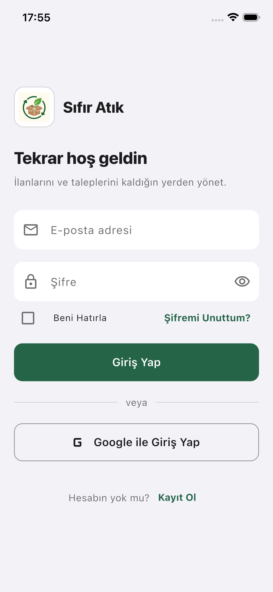
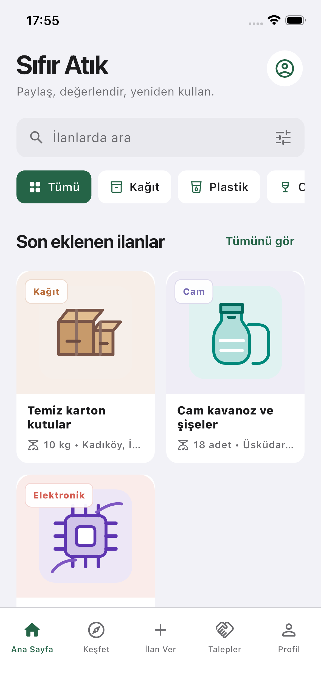
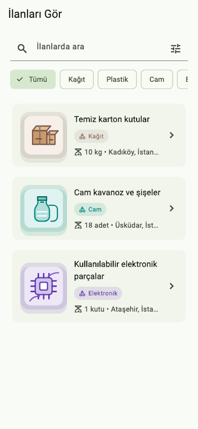
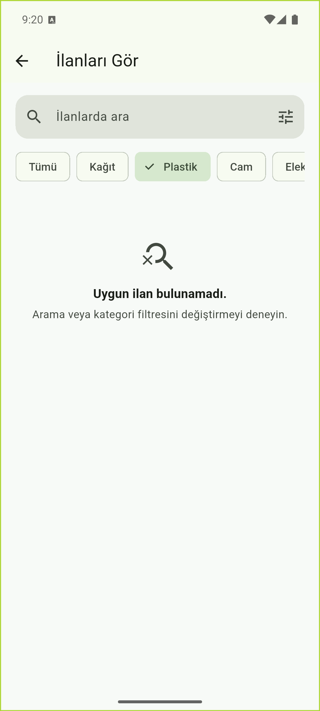
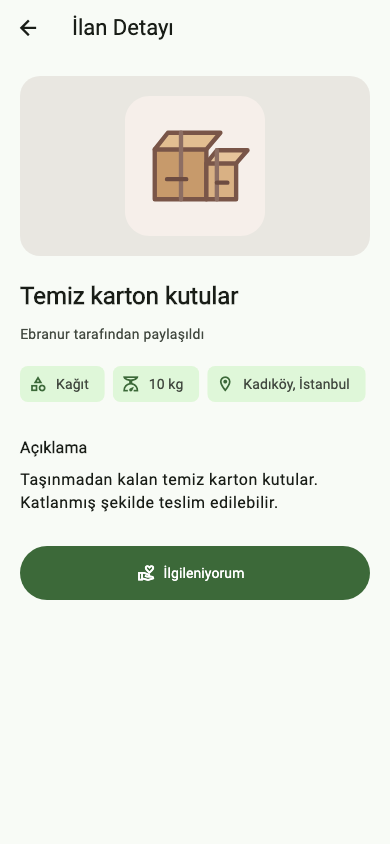
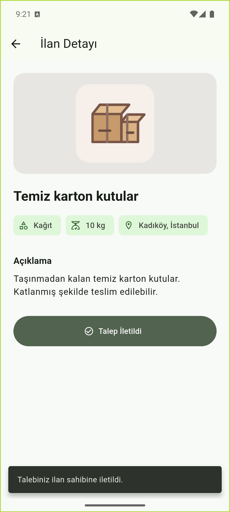
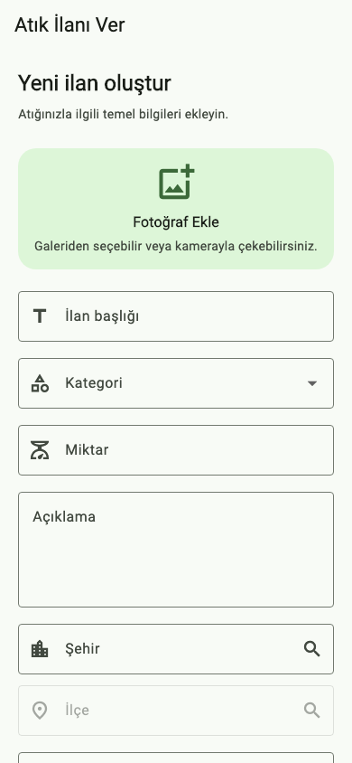

# Sıfır Atık

Sıfır Atık, kullanıcıların kullanmadığı ama değerlendirilebilir durumda olan
atıkları ilan olarak paylaşabilmesi için geliştirdiğim bir Flutter mobil
uygulamasıdır. Uygulamada amaç, karton, cam, elektronik parça gibi atıkların
ihtiyacı olan kişiler tarafından daha kolay bulunabilmesini sağlamaktır.

## Bu Projedeki Odak Noktalarım

Bu projede daha önce kullandığım form doğrulama, durum yönetimi ve sayfalar
arası geçiş yapılarını pekiştirdim. Bunun yanında responsive arayüz, Material 3
tasarımı, SVG görsel kullanımı ve widget testleri üzerine çalıştım.

- Farklı ekran genişliklerine uyum sağlayan arayüzler geliştirdim
- Material 3 tema yapısını ve hazır bileşenleri kullandım
- Arama ve kategori filtrelerinin durumunu yönettim
- SVG görselleri Flutter arayüzüne entegre ettim
- Widget testleriyle kullanıcı etkileşimlerini kontrol ettim
- Aynı Flutter kodunu Android ve iOS ortamları için yapılandırdım

## Uygulamada Neler Var?

- Material 3 uyumlu, responsive giriş ekranı
- E-posta ve şifre alanları için form kontrolü
- Şifre görünürlüğü ve şifre güç göstergesi
- Beni hatırla seçeneği
- Google ile giriş butonu
- Giriş sırasında loading durumu ve hata bildirimi
- Atık ilanı verme ve ilanları görme seçeneklerini sunan ana ekran taslağı
- Doğrulamalı atık ilanı oluşturma formu
- Arama ve kategori filtreleri içeren örnek ilan listesi
- İlan detay ekranı ve ilgi/talep gönderme akışı

## Uygulamadan ekranlar

| Giriş | Ana ekran |
| --- | --- |
|  |  |

| İlanlar | Filtre sonucu |
| --- | --- |
|  |  |

| İlan detayı | Talep gönderildi |
| --- | --- |
|  |  |

| İlan oluşturma |
| --- |
|  |

## Projeyi Çalıştırma

Flutter SDK'nın kurulu olduğundan emin olduktan sonra:

```bash
flutter pub get
flutter run
```

Kod kalitesi ve testleri kontrol etmek için:

```bash
flutter analyze
flutter test
```

## Proje durumu

Uygulama şu anda geliştirme aşamasındadır. Giriş, ilan oluşturma, ilan
listeleme, filtreleme ve talep gönderme akışları arayüz seviyesinde
hazırlanmıştır. Veriler şimdilik örnek olarak tutulmaktadır; henüz Firestore'a
kaydedilmez veya gerçek bir veritabanından çekilmez.

E-posta/şifre ve Google ile giriş alanları arayüzde yer almaktadır. Gerçek
Firebase Authentication bağlantısı projenin sonraki aşamasında tamamlanacaktır.
