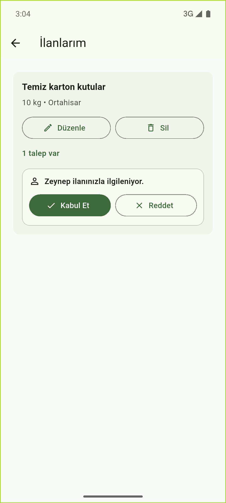
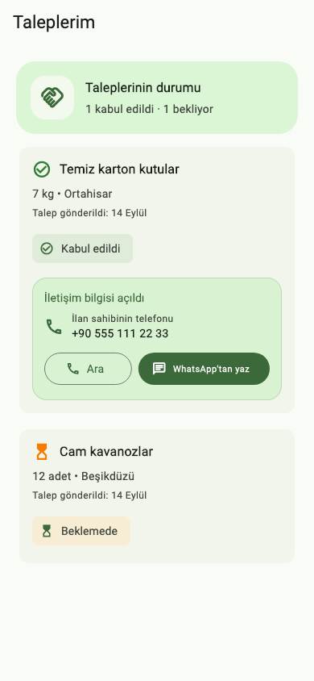
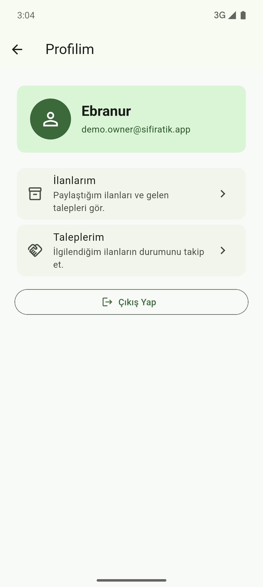

# Sıfır Atık

Sıfır Atık, kullanıcıların kullanmadığı ama değerlendirilebilir durumda olan
atıkları ilan olarak paylaşabilmesi için geliştirdiğim bir Flutter mobil
uygulamasıdır. Uygulamada amaç, karton, cam, elektronik parça gibi atıkların
ihtiyacı olan kişiler tarafından daha kolay bulunabilmesini sağlamaktır.

## Bu Projede Neler Üzerinde Çalıştım?

Bu projede hem Flutter tarafında pratik yapmak hem de gerçek verilerle çalışan
bir uygulama akışı kurmak istedim. Daha önce kullandığım form doğrulama, sayfalar
arası geçiş ve durum yönetimi yapılarını bu projede tekrar kullandım. Sonrasında
Firebase bağlantısını ekleyerek ilan ve talep bilgilerinin uygulamada kalıcı
olmasını sağlamaya çalıştım.

- Farklı ekran genişliklerine uyum sağlayan arayüzler geliştirdim
- Material 3 tema yapısını ve hazır bileşenleri kullandım
- Arama ve kategori filtrelerinin durumunu yönettim
- SVG görselleri Flutter arayüzüne entegre ettim
- Widget testleriyle kullanıcı etkileşimlerini kontrol ettim
- Firebase Firestore ile ilan ve talep verilerini kaydettim
- Firebase Storage ile ilanlara fotoğraf ekleme kısmını yaptım
- Giriş yapan kullanıcı için basit bir oturum kontrolü ekledim

## Uygulamada Bulunan Özellikler

### Giriş ve kullanıcı işlemleri

- E-posta/şifre ile giriş yapma ve kayıt olma
- Google ile giriş akışı
- Şifre görünürlüğü, şifre güç göstergesi ve şifre sıfırlama
- Beni hatırla seçeneği ve uygulama açılışında oturum kontrolü
- Profilim sayfası ve çıkış yapma

### İlan işlemleri

- Atık ilanı oluşturma, listeleme ve detay ekranı
- Galeriden veya kameradan ilan fotoğrafı seçme
- İlan fotoğrafını güncelleme veya kaldırma
- İlan oluştururken telefon numarasının SMS koduyla doğrulanması
- Arama ve kategori filtreleriyle ilanları bulma
- Kullanıcının kendi ilanlarını İlanlarım sayfasında görmesi
- İlan sahibinin kendi ilanlarını düzenleyebilmesi ve silebilmesi

### Talep işlemleri

- Kullanıcının ilgilendiği ilana talep göndermesi
- Gönderilen taleplerin Taleplerim sayfasında görünmesi
- İlan sahibinin gelen talepleri kabul veya reddetmesi
- Talep durumunun beklemede, kabul edildi veya reddedildi olarak takip edilmesi
- Talep kabul edilince iletişim bilgilerinin açılması
- Kabul edilen taleplerde ilan sahibini doğrudan arama veya WhatsApp üzerinden
  mesaj gönderme
- İlan listesi tekrar açıldığında talep durumlarının güncel kalması

## Uygulamadan ekranlar

| Giriş | Ana ekran |
| --- | --- |
|  |  |

| İlanlar | Filtre sonucu |
| --- | --- |
|  |  |

| İlan detayı | Talep gönderildi |
| --- | --- |
|  |  |

| İlan oluşturma | İlanlarım |
| --- | --- |
|  |  |

| Taleplerim | Kabul sonrası iletişim | Profilim |
| --- | --- | --- |
|  |  |  |

## Projeyi Çalıştırma

Bu proje şu anda Android platformunda geliştirilmiş ve test edilmiştir. Flutter
SDK'nın kurulu olduğundan emin olduktan sonra Android emülatörde:

```bash
flutter pub get
flutter run
```

Kod kalitesi ve testleri kontrol etmek için:

```bash
flutter analyze
flutter test
```

## Test durumu

Projede widget testleri ve repository testleri bulunuyor. Widget testleriyle
giriş ekranındaki form alanlarını, şifre göstergesini, sayfalar arası geçişleri,
ilan oluşturma formunu, arama ve kategori filtrelerini kontrol ediyorum.

Repository testlerinde ise sahte Firestore kullanarak ilan ekleme, ilan
düzenlenince bağlı talep bilgisinin güncellenmesi, ilan silinince ilgili
taleplerin kaldırılması ve talep durumunun güncellenmesi gibi akışları
deniyorum. Ayrıca kullanıcının kendi ilanına talep gönderememesi, başarısız
talep işleminde yanlışlıkla başarılı mesaj gösterilmemesi, fotoğraf kaldırma ve
talep durumlarının ekranda doğru görünmesi de test ediliyor.

Gerçek kayıt olma, Google ile giriş, SMS doğrulaması, fotoğraf yükleme ve iki
farklı kullanıcıyla baştan sona çalışan talep akışı için ileride ayrıca
entegrasyon testleri eklenebilir. Bu kısımları şimdilik Android emülatör
üzerinde manuel olarak kontrol ediyorum.

## Manuel test senaryosu

Android emülatörde iki farklı kullanıcıyla şu akışı kontrol ettim:

1. İlk kullanıcıyla giriş yapıp örnek bir ilan oluşturdum.
2. İlan oluştururken telefon numarasına gelen SMS kodunu doğruladım.
3. İkinci kullanıcıyla giriş yapıp bu ilana talep gönderdim.
4. İlk kullanıcıyla tekrar giriş yapıp gelen talebi İlanlarım ekranında gördüm.
5. Talebi kabul ettiğimde ikinci kullanıcının Taleplerim ekranında durumun
   güncellendiğini kontrol ettim.
6. Talep kabul edildikten sonra telefon numarası görünür hale geldi. Kullanıcı
   isterse ilan sahibini arayabiliyor, isterse WhatsApp üzerinden hazır mesajla
   iletişime geçebiliyor.

## Proje durumu

Projeyi şu an Android emülatör üzerinden geliştirip test ediyorum. Kullanıcı
giriş yaptıktan sonra ilan oluşturabiliyor, fotoğraf ekleyebiliyor, kendi
ilanlarını düzenleyip silebiliyor ve başka ilanlara talep gönderebiliyor.

Firestore'da henüz ilan yoksa uygulamanın tamamen boş görünmemesi için birkaç
örnek ilan gösteriyorum. Gerçek ilan eklendiğinde liste Firebase'deki verilerle
güncelleniyor.

Şimdilik temel Android akışlarını demo yapılabilecek seviyeye getirdim. İleride
iOS tarafındaki izin ve platform ayarlarını da ayrıca kontrol ederek uygulamayı
iki platformda daha düzenli hale getirmeyi düşünüyorum.

Android release ayarında şu an debug imza anahtarı kullanılıyor. Bu demo ve
yerel denemeler için yeterli; uygulama Play Store'a çıkarılacak olursa ayrı bir
release imza ayarı yapılması gerekir.
